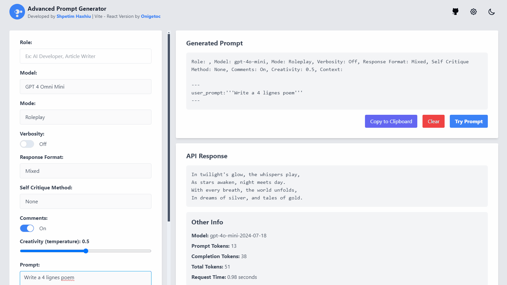

# Advanced Prompt Generator with Vite React & Tailwind

This project is based on the [Advanced Prompt Generator](https://github.com/shpetimhaxhiu/advanced-prompt-generator) but made with Vite, React, and Tailwind. It includes more models and features both a Light and Dark theme. This is a simple yet powerful web application that allows users to interact with OpenAI's GPT-based language models through a convenient and user-friendly interface. Built using modern web technologies, it employs the [OpenAI API](https://beta.openai.com/) to generate AI responses, making it an excellent tool for generating advanced prompts and maximizing the potential of OpenAI models.



## Table of Contents

- [Features](#features)
- [Prerequisites](#prerequisites)
- [Installation](#installation)
- [Usage](#usage)
- [Models](#models)
- [Dependencies](#dependencies)
- [Contributors](#contributors)
- [License](#license)
- [Acknowledgements](#acknowledgements)

## Features

- Easy-to-use interface for interacting with GPT-based language models.
- Support for various models including GPT 4 Omni and OpenAI models.
- Customizable settings for role, model, mode, verbosity, response format, self-critique method, comments, and creativity.
- Live output display and API response logging.
- Copy to clipboard and clear output functionality.

## Prerequisites

- A modern web browser that supports HTML5, CSS3, and JavaScript.
- Access to OpenAI's & Groq API and a valid API key.

## Installation

Installation is as simple as cloning the repository to your local machine and running the project.

1. Fork the repository to your GitHub account.
2. Clone the repository to your local machine:

   ```shell
   git clone https://github.com/shpetimhaxhiu/advanced-prompt-generator.git
   ```

## Usage
   ```shell
   npm run dev
   ```

To use the Advanced Prompt Generator, follow these steps:

1. Clone the repository to your local machine.
2. Open the `index.html` file in your web browser.
3. Fill in the desired values for the prompt parameters:
   - **Role**: Enter the desired role for the AI, such as "Growth Hacker AI," "Web Developer AI," or "Web Design."
   - **Model**: Select the AI model you want to use. Choose from the options listed below.
   - **Mode**: Select the mode for the AI. Choose between "Roleplay" and "Story."
   - **Verbosity**: Select the verbosity level. Choose between "On" and "Off."
   - **Response Format**: Select the desired response format. Choose from "Mixed," "Code Only," "Markdown," "JSON," and "HTML."
   - **Self Critique Method**: Select the self-critique method from the available options.
   - **Comments**: Choose whether to include comments in the AI response. Choose between "On" and "Off."
   - **Creativity**: Adjust the creativity level of the AI response using the slider.
   - **Prompt**: Enter the prompt text for the AI.
   - **Context**: Provide additional context if necessary.
4. Click the **Submit** button to generate the AI response.
5. The generated output will be displayed in the **Output** section.
6. Use the available options in the **Output** section to copy the response to the clipboard or clear the output.

## Models

- GPT 4 Omni Mini (gpt-4o-mini)
- GPT 4 Omni (gpt-4o-2024-08-06)
- OpenAI 01 Mini (o1-mini)
- OpenAI 01 Preview (o1-preview)
- Tous les modèles gratuits de l'API Groq ci-dessous ↓
- Groq Llama 3.1 8B (llama-3.1-8b-instant)
- Groq Llama 3.1 70B (llama-3.1-70b-versatile)
- Mixtral 8x7B (mixtral-8x7b-32768)
- Gemma 2 9B (gemma2-9b-it)
- Gemma 7B (gemma-7b-it)

*Note: Additional models such as Claude and Gemini are commented out in the configuration and can be included when necessary but some change should be done for their particularity.*

## Dependencies

- Vite
- React
- Tailwind CSS
- OpenAI API

## License

This project is licensed under the [MIT License](LICENSE). Feel free to use it any way you like! 💪

## Acknowledgements

- [OpenAI](https://www.openai.com/) for the language models and API.
- [Tailwind CSS](https://tailwindcss.com/) for the CSS framework.
- [Vite](https://vitejs.dev/) for the build tool.
- [React](https://reactjs.org/) for the frontend library.
- Additional models and frameworks as needed.
